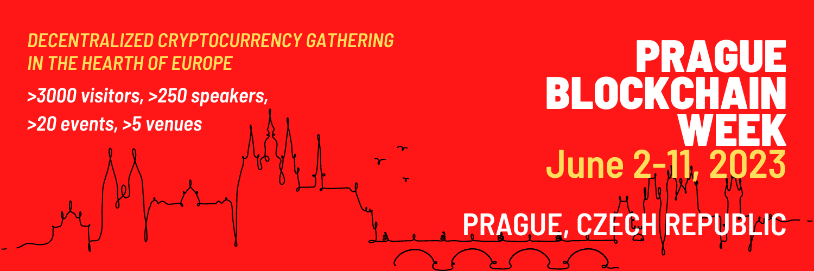

# ⭐ Welcome to Prague Blockchain Week 2023

<figure><figcaption></figcaption></figure>

**Prague Blockchain Week 2023** (PBW23) is a _decentralized conference_ and gathering of all people interested in cryptocurrencies and related topics. It consists of many **independent events** across Jun 2 - 11, including conferences, hackathons, workshops, community meetups, as well as various parties and happy hours.&#x20;

These events will focus on a variety of different cryptocurrency ecosystems and topics such as hard money, payments, DeFi, Web3, DAOs, CryptoEconomics, NFTs, DeSci, mining, and many more.

It is a chain agnostic and neutral community-led initiative. Our goal is not to promote one single blockchain, but rather to stimulate discussion between proponents of different solutions. The common theme is financial freedom, decentralization and privacy.


If you want to get the most up-to-date information and news about the event, follow our [Twitter account](https://twitter.com/PrgBlockWeek) ([Czech version](https://twitter.com/PrgBlockWeekCZ)).


## PBW23 is open to everyone!

We are an open conference that offers a variety of independently hosted events. Attendees have the freedom to choose which events they would like to participate in, and can plan their own attendance and travel arrangements. There is no obligation to attend any specific events, so attendees have the flexibility to create their own conference experience.

Would you like to organize an event? No problem! Anyone can host an event at PBW23. For more information visit the [Event Host Guide](event-host-guide/).

If you have any questions, ideas for improvements or comments, please [contact us](contact-us.md).

## Table of Contents


[attendees-guide](attendees-guide/)



[event-host-guide](event-host-guide/)



[promo-toolkit.md](promo-toolkit.md)



[our-mission-and-team](our-mission-and-team/)



[faq.md](faq.md)



[contact-us.md](contact-us.md)



[impressum.md](impressum.md)

