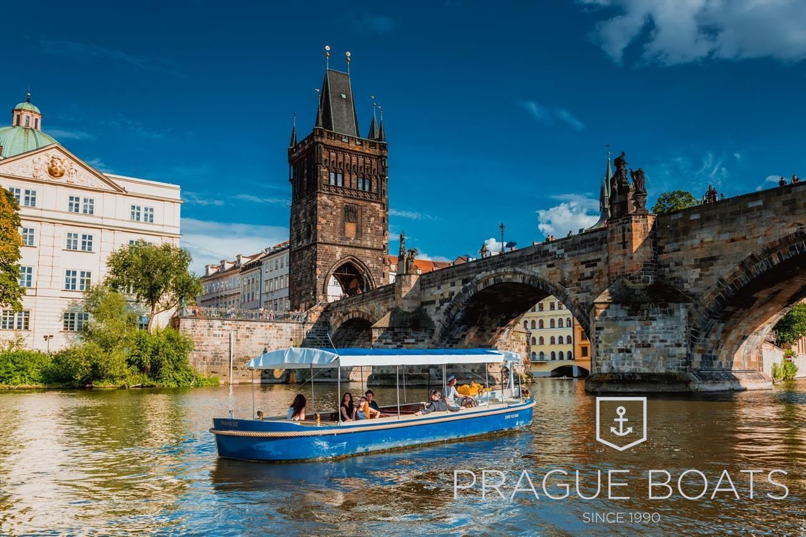

# ⛵ Event Ideas

********

* **Wine Tasting**: Prague has a variety of wine tasting venues, such as [Zazitkove Degustace](https://zazitkovedegustace.cz/) or [Veltlin Wine Bar](https://www.veltlin.cz/en), that offer unique and exclusive experiences for corporate events.
* [Prague Castle Tour](https://www.lucytours.com/private-tour/prague-castle-tour/): Take a private tour of one of the most iconic landmarks in Prague, and learn about the city's history and culture.
* [Cooking Classes](https://airkitchen.me/list/czech-republic/prague/): Prague has several cooking schools that offer team building activities or private classes for groups.
* [Boat Tours](https://www.prague-boats.cz/all-private-cruises): Take a private boat tour on the Vltava River, and enjoy stunning views of the city while networking.
* **Beer Tasting**: Prague is famous for its beer, and there are several beer tasting venues such as [Prague Craft Beer Tasting](https://www.grandbeertasting.com/), [Pivovarský dům](https://www.pivo-dum.cz/en/events) or [Lokál](https://lokal.ambi.cz/en/draughting-school/) that offer unique and exclusive experiences for brand events.
* **Rooftop Bars**: Prague has several rooftop bars such as [Cloud 9 Sky Bar & Lounge](https://cloud9.cz/en/plan-your-event/), [Zizkovska vez](https://towerpark.cz/event-studio/) or [Terasa U Prince](https://www.terasauprince.com/en/corporate-events-catering-prague-city-centre) that offer stunning views of the city and a unique and exclusive atmosphere for your event.
* **Karaoke Night**: Host a private karaoke night at one of Prague's karaoke venues such as [K Star Karaoke](https://www.kstarkaraoke.com/en/), and enjoy a fun and interactive networking experience.
* **Brewery Tours**: Take a private tour of one of Prague's [Staropramen Brewery](https://www.centrumstaropramen.cz/en/), and learn about the city's beer making history.
* **Trampoline Park**: For a fun and unique activity, try out one of Prague's trampoline parks such as [JumpPark](https://www.jumppark.cz/).
* [Archery](https://www.archerygame.cz/): Archery is a unique and fun team building activity that can be organized in various locations around the city.
* **Beach Volleyball:** Prague has several indoor and outdoor beach volleyball venues such as [Žluté lázně](https://www.zlutelazne.cz/en/), which offer a fun and active team building activity.
